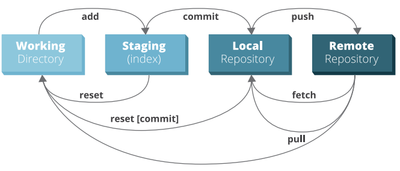
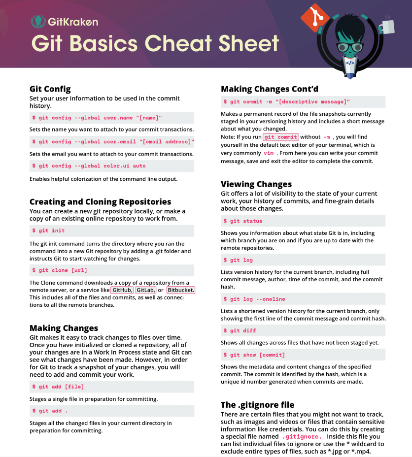
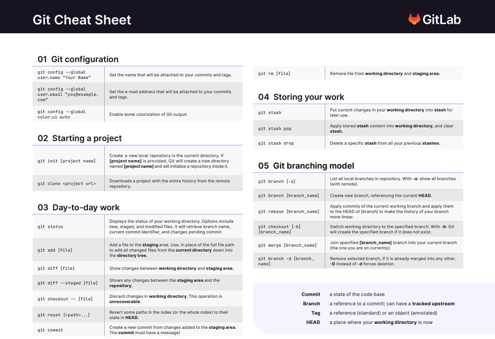
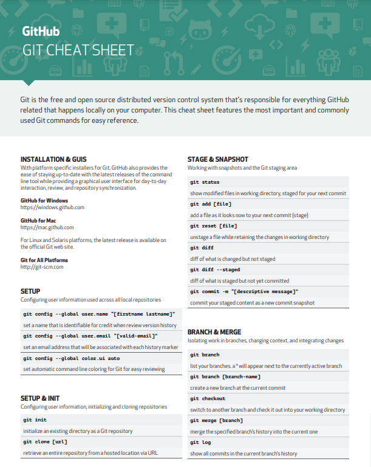
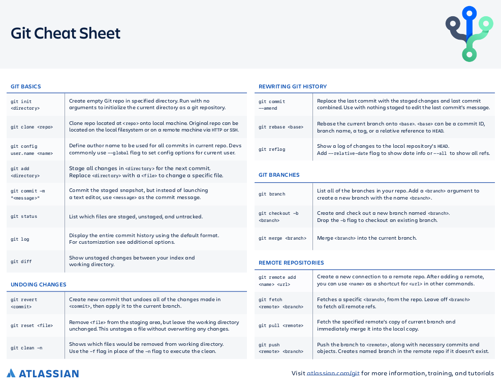
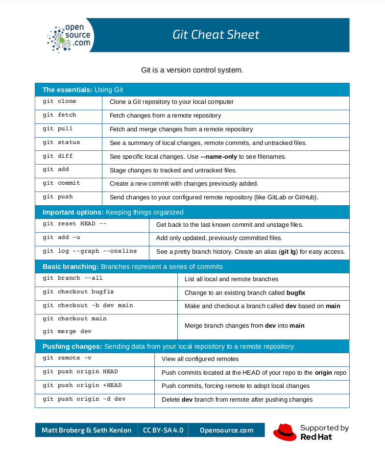
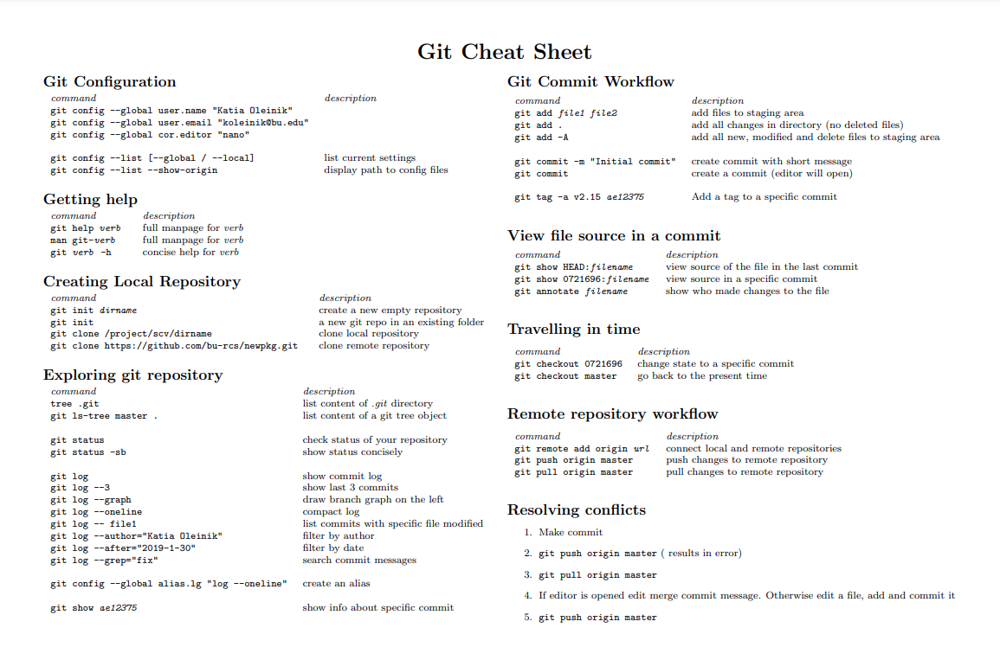

# Git Cheatsheets

  

  
</p

### GitKraken

[GitKraken git cheatsheet](./files/gitkraken-git-basics-cheat-sheet.pdf)

https://www.gitkraken.com/learn/git/commands

### GitLab

[GitLab git cheatsheet](./files/git-cheat-sheet_gitlab.pdf)

### GitHub

[GitHub git cheatsheet](./files/github-cheat-sheet-education.pdf)

### Atlassian

[Atlassian git cheatsheet](./files/git-SWTM-2088_Atlassian-Git-Cheatsheet.pdf)

### Git-Tower

https://www.git-tower.com/blog/git-cheat-sheet/

### OpenSource.com

[OpenSource.com git cheatsheet](./files/git-OSDC_cheatsheet-git-2022.4.7.pdf)

https://opensource.com/downloads/cheat-sheet-git

### Boston University

[Boston University git cheatsheet](./files/boston-university_Git_CheatSheet.pdf)

**Other useful links:**

https://gitcheatsheet.org/
